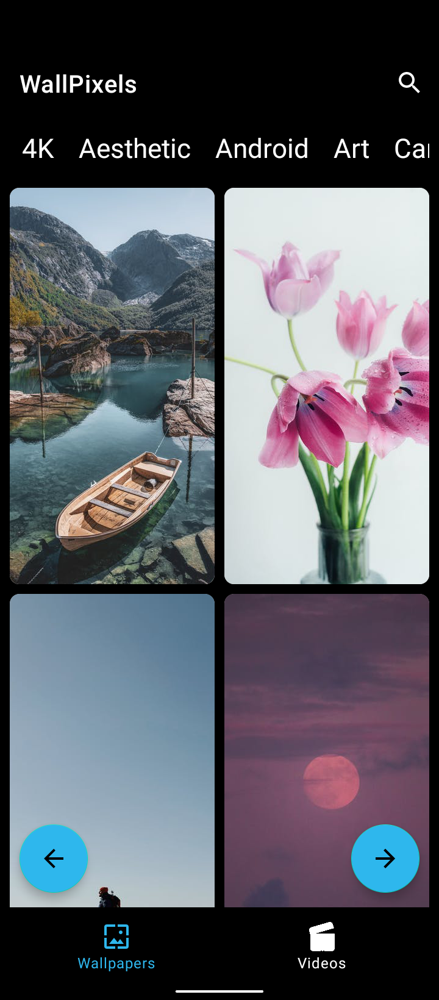
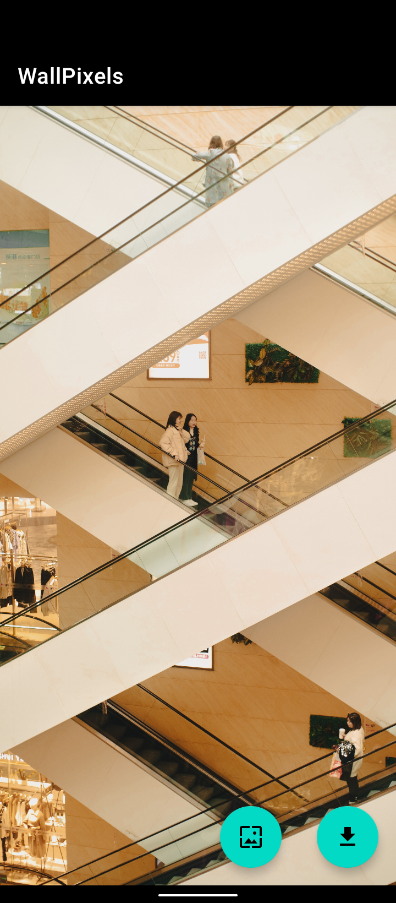
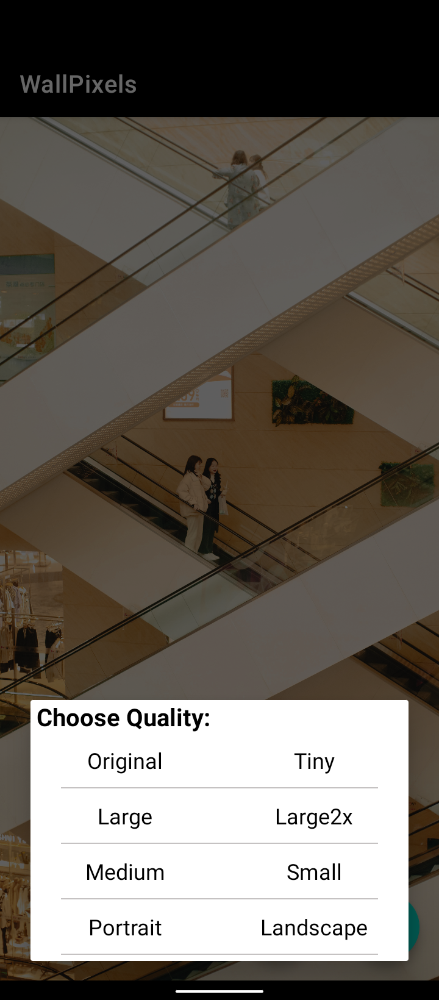
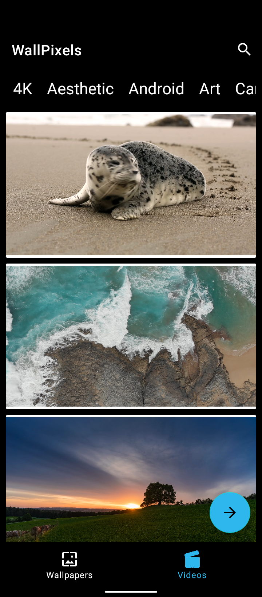
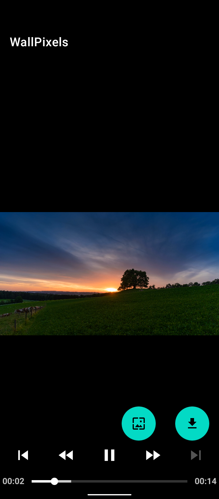

# WallPixels - Your Ultimate Source for Stunning Wallpapers and Videos 🌟

Welcome to Wallpixels, the native Android app designed to transform your device with a vast collection of high-quality wallpapers and videos! 🎉

  

## Features

- **Extensive Collection:** Discover hundreds of different wallpapers, pictures, and videos to suit every style.
- **Download Flexibility:** Download wallpapers and videos to your mobile storage with options for different download qualities.
- **Set as Wallpaper:** Easily set your favorite wallpapers or videos as your home screen background directly from within the app.

## Tech Stack

- **Language:** Java
- **API:** Pexels.com
- **Download Management:** Retrofit (for seamless data fetching)

## Getting Started

To get started with Wallpixels:

1. Clone this repository to your local machine.
2. Open the project in Android Studio.
3. Run the app on an emulator or a physical device.

## Usage

- Explore the vast collection of wallpapers and videos.
- Download your favorites with different quality options.
- Set stunning wallpapers or videos as your device's home screen background.

              

              

## Contributing

Contributions are welcome! If you'd like to contribute, please follow these steps:

1. Fork this repository.
2. Create a new branch for your feature or bug fix.
3. Commit your changes and submit a pull request.

## Acknowledgments

Special thanks to the Pexels Team for providing the API that powers this app.

Feel the transformation! Download Wallpixels now and elevate your device's visual appeal. 📲🖼️

#Wallpixels #AndroidApp #Java #Wallpapers #Videos
